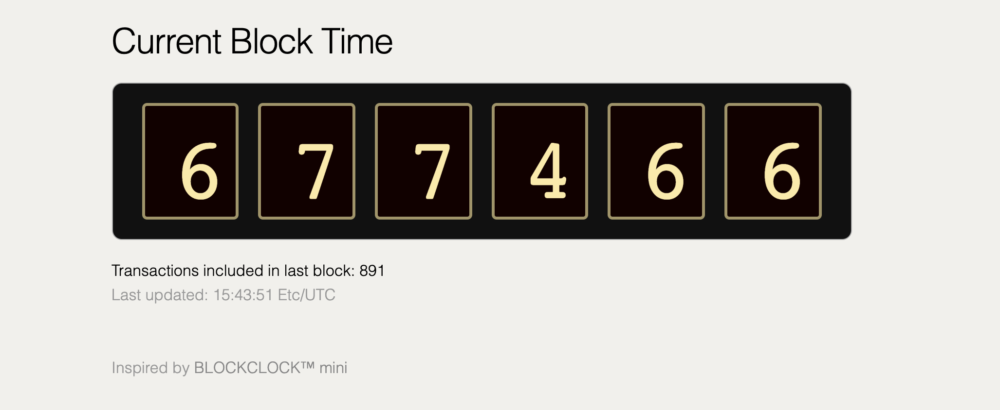
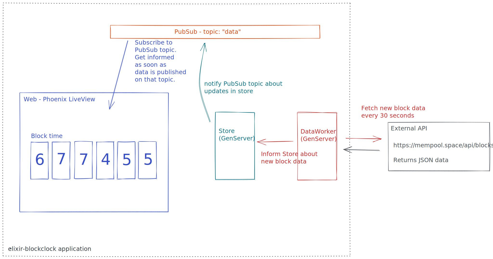

# Elixir Block Clock

`elixir-blockclock` is a simple implementation to display the current "block
time" of Bitcoin's blockchain.

It is inspired by the wonderful [BLOCKCLOCK™
mini](https://blockclockmini.com/).
This project exists only to explore some of the concepts one will encounter
when diving deeper into Elixir. Since Bitcoin and Blockchain is another fun
topic to explore, I've decided to fetch the current block time and display
the result similar as the Blockclock does. It is by no means an attempt to
copy the project.

## Setup

All related code lives under `./src`.

## asdf-vm

We manage runtime versions via [`asdf-vm`](https://asdf-vm.com/) (see
`./.tool-versions`). Be sure to install all specified versions.

## What it looks like

## High level overview

